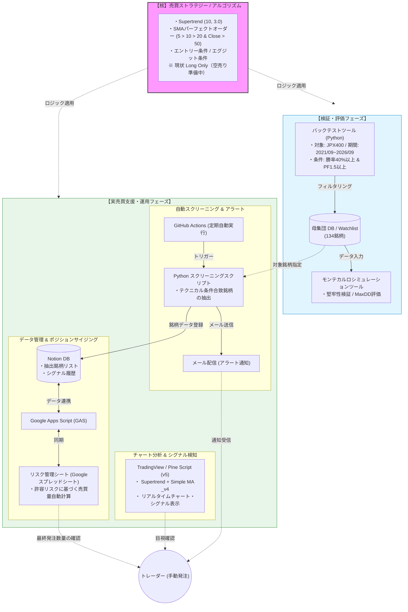

# 20261010_システムアーキテクチャ図（コンポーネント構成図）

```mermaid
flowchart TB
    subgraph StrategyCore["【核】売買ストラテジー / アルゴリズム"]
        direction TB
        Logic["・Supertrend (10, 3.0)\n・SMAパーフェクトオーダー (5 > 10 > 20 & Close > 50)\n・エントリー条件 / エグジット条件\n※ 現状 Long Only（空売り準備中）"]
    end

    subgraph Verification["【検証・評価フェーズ】"]
        direction TB
        BT["バックテストツール (Python)\n・対象: JPX400 / 期間: 2021/09~2026/09\n・条件: 勝率40%以上 & PF1.5以上"]
        MC["モンテカルロシミュレーションツール\n・堅牢性検証 / MaxDD評価"]
        Watchlist[("母集団 DB / Watchlist\n(134銘柄)")]

        BT -->|フィルタリング| Watchlist
        Watchlist -->|データ入力| MC
    end

    subgraph Operation["【実売買支援・運用フェーズ】"]
        direction TB

        subgraph Analysis["チャート分析 & シグナル検知"]
            TV["TradingView / Pine Script (v5)\n・ Supertrend + Simple MA _v4\n・ リアルタイムチャート・シグナル表示"]
        end

        subgraph AutoScreening["自動スクリーニング & アラート"]
            GHA["GitHub Actions (定期自動実行)"]
            PyScript["Python スクリーニングスクリプト\n・テクニカル条件合致銘柄の抽出"]
            Mail["メール配信 (アラート通知)"]

            GHA -->|トリガー| PyScript
            PyScript -->|メール送信| Mail
        end

        subgraph DataAndRisk["データ管理 & ポジションサイジング"]
            Notion[("Notion DB\n・抽出銘柄リスト\n・シグナル履歴")]
            GAS["Google Apps Script (GAS)"]
            Sheet["リスク管理シート (Googleスプレッドシート)\n・許容リスクに基づく売買量自動計算"]

            PyScript -->|銘柄データ登録| Notion
            Notion <-->|データ連携| GAS
            GAS <-->|同期| Sheet
        end
    end

    %% 連携関係
    StrategyCore .->|ロジック適用| Verification
    StrategyCore .->|ロジック適用| Operation
    Watchlist .->|対象銘柄指定| PyScript
    Sheet .->|最終発注数量の確認| Trader(("トレーダー (手動発注)"))
    TV .->|目視確認| Trader
    Mail .->|通知受信| Trader

    %% スタイル定義
    classDef core fill:#f9f,stroke:#333,stroke-width:2px;
    classDef verif fill:#e1f5fe,stroke:#0288d1,stroke-width:1px;
    classDef oper fill:#e8f5e9,stroke:#388e3c,stroke-width:1px;
    
    class StrategyCore core;
    class Verification verif;
    class Operation oper;
```
